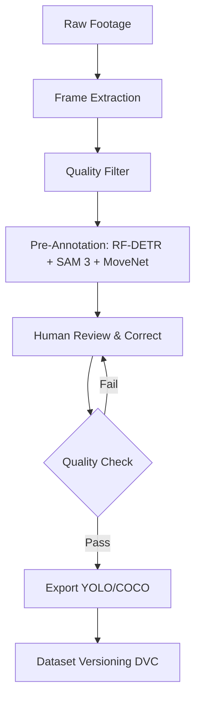

# Phase 1 Technical Development Plan
## Factory Smart Camera AI System

**Version:** 2.0
**Date:** March 7, 2026 (revised from v1.0 March 5, 2026)
**Status:** Technical Blueprint — Revised for 3-engineer parallel execution

---

## Executive Summary

This document provides the complete technical development roadmap for Phase 1 AI models (6 models: Fire, Helmet, Safety Shoes, Fall Detection, Poketenashi, Zone Intrusion). It covers industry benchmarking, dataset strategy, labeling requirements, development methodology, and validation protocols.

**Timeline:** 12 weeks (9 weeks active + 3 weeks buffer)
**Primary Acceptance Targets:** Precision ≥ 0.85-0.94, Recall ≥ 0.82-0.92, FP Rate < 2-5%, FN Rate < 2-6% (per model)
**Internal Tracking Metric:** mAP@0.5 ≥ 0.80-0.92 (used during training iteration, not final acceptance)
**Deployment Constraint:** < 12W power consumption on NPU-based edge hardware (TBD — similar to Hailo-8 or RK3588)

---

## Table of Contents

1. [Phase 1 Model Overview](#1-phase-1-model-overview)
2. [Industry Research & Benchmarking](#2-industry-research--benchmarking)
3. [Dataset Strategy](#3-dataset-strategy)
4. [Labeling Plan](#4-labeling-plan)
5. [Development Methodology](#5-development-methodology)
6. [Validation & Testing](#6-validation--testing)
7. [Risk Mitigation](#7-risk-mitigation)
8. [Resource Planning](#8-resource-planning)
9. [Success Metrics](#9-success-metrics)
10. [Next Steps](#10-next-steps)

## Per-Model Development Plans (Separate Files)

| Model | File | Owner |
|---|---|---|
| **a** Fire Detection | [03a_model_fire.md](plans/a_fire.md) | E1 |
| **b** Helmet Detection | [03b_model_helmet.md](plans/b_helmet.md) | E2 |
| **f** Safety Shoes Detection | [03f_model_shoes.md](plans/f_safety_shoes.md) | E2 |
| **g** Fall Detection | [03g_model_fall.md](plans/g_fall_detection.md) | E1 (pose) + E3 (classify) |
| **h** Poketenashi | [03h_model_poketenashi.md](plans/h_poketenashi.md) | E3 |
| **i** Zone Intrusion | [03i_model_zone_intrusion.md](plans/i_zone_intrusion.md) | E2 |

> Per-model details (SOTA benchmarks, dataset sources, annotation guidelines, week-by-week plans, contingencies, build-vs-outsource) have been moved to the model files above. Each model file merges research + development plan into a single reference.

---

## 1. Phase 1 Model Overview

### 1.1 Model Portfolio

| ID | Model | Architecture | Classes | Input Size | Target mAP@0.5 | Target Precision | Target Recall | Max FP Rate | Max FN Rate |
|---|---|---|---|---|---|---|---|---|---|
| **a** | **Fire Detection** | YOLOX-M | fire, smoke | 640/1280 | ≥ 0.85 | ≥ 0.90 | ≥ 0.88 | < 3% | < 5% |
| **b** | **PPE: Helmet** | YOLOX-M | person, helmet, no_helmet | 640/1280 | ≥ 0.92 | ≥ 0.94 | ≥ 0.92 | < 2% | < 3% |
| **f** | **PPE: Safety Shoes** | YOLOX-M | person, safety_shoes, no_safety_shoes | 640/1280 | ≥ 0.85 | ≥ 0.88 | ≥ 0.85 | < 4% | < 5% |
| **g-classify** | **Fall Detection** | YOLOX-M | person, fallen_person | 640 | ≥ 0.85 | ≥ 0.90 | ≥ 0.88 | < 3% | < 2% |
| **h** | **Poketenashi** | YOLOX-M + YOLOX-T | phone (detection) | 640 | ≥ 0.80 | ≥ 0.85 | ≥ 0.82 | < 5% | < 6% |
| **i** | **Zone Intrusion** | YOLOX-T (pretrained) | person (pretrained) | 640 | ≥ 0.92 | ≥ 0.94 | ≥ 0.92 | < 2% | < 3% |

> *Note: All models use Apache 2.0 license — free commercial use.
> **Edge Constraint:** MoveNet (Apache 2.0) is edge-deployable via TensorFlow Lite — used for fall detection pose and poketenashi keypoint rules.

> **Note:** All performance metrics above are **technical team proposals** — the customer has not specified quantitative accuracy targets. These targets require customer verification and alignment before being adopted as acceptance criteria.

**Note:** Model (i) Zone Intrusion uses pretrained person detection - no custom training required. Only zone polygon configuration and alert logic implementation needed.

### 1.2 Technical Challenges by Model

| Model | Primary Challenge | Technical Strategy |
|---|---|---|
| Fire Detection | Long-range detection (325m for 1×1m fire) | 1280px input, multi-scale training |
| Helmet | Small object detection at distance | 1280px input, high-resolution training |
| Safety Shoes | Small dataset (3.7K), frequent occlusion | 1280px default, aggressive augmentation, factory data collection |
| Fall (Pose) | Only 111 keypoint-annotated images | COCO pretrain → auto-annotate bbox images → fine-tune |
| Fall (Classify) | Class imbalance (fallen vs standing) | COCO standing persons for balance (6K sampled) |
| Poketenashi | Phone detection only; other behaviors are pose rules | Train phone detector, implement pose-based rules separately |
| Zone Intrusion | False alarms in authorized zones | Pretrained person detection + configurable zone polygons |
| **All Models** | **Data quality unknowns in large public datasets** | **Progressive data strategy: start with curated v1 subsets (~10-20%) to validate pipeline and catch data quality issues early, then expand in v2/v3** |

### 1.3 Technical Approach Summary

Each model uses a distinct technical approach tailored to its detection task:

| ID | Model | Approach | Models Used | What Needs Training | What's Pretrained/Rule-Based | Difficulty |
|---|---|---|---|---|---|---|
| **a** | Fire Detection | Single-model detection | YOLOX-M | Fine-tune on 122K fire/smoke images | — | **LOW** |
| **b** | Helmet Detection | Single-model detection | YOLOX-M | Fine-tune on 62K helmet images + nitto_hat custom data | — | **LOW-MED** |
| **f** | Safety Shoes | Single-model detection | YOLOX-M | Fine-tune on 3.7K+ shoe images (1280px default) | — | **HIGH** |
| **g** | Fall Detection | **Dual-model ensemble** | MoveNet (g-pose) + YOLOX-M (g-classify) | g-pose: COCO pretrain → fine-tune on CCTV fall (111 imgs + auto-annotated). g-classify: fine-tune on 17K fallen/standing | Temporal consistency logic, ensemble voting | **HIGH** |
| **h** | Poketenashi | **Hybrid: detection + pose + rules** | YOLOX-M (phone) + MoveNet (keypoints) + YOLOX-T (person) | Phone detection: fine-tune YOLOX-M on FPI-Det (~13K) | Person detection (COCO pretrained), Pose estimation (COCO-Pose pretrained), Rule engine (hands-in-pockets, no-handrail), Stair zone polygons | **HIGH** |
| **i** | Zone Intrusion | **Pretrained + logic** | YOLOX-T (person) | None — pretrained only | Person detection (COCO pretrained), PolygonZone + ByteTrack, Alert logic (intrusion, loitering, direction, line-crossing) | **LOW** |
| **all** | **Custom Multi-Head** | Single model for all classes | YOLOX backbone + custom head | Fine-tune on merged dataset (all classes) | Shared backbone features | **HIGH** (dataset imbalance) |

**Key architectural patterns:**
- **Models a, b, f:** Standard YOLO detection pipeline — train a single model, export to ONNX
- **Model g:** Two independent models whose outputs are fused via temporal ensemble logic for higher confidence
- **Model h:** Multi-model pipeline where phone detection (trained) combines with pose estimation (pretrained) and rule-based classification (no training) to detect 3 behaviors
- **Model i:** Zero training — uses pretrained person detection with configurable zone polygons and tracking logic

---

## 2. Industry Research & Benchmarking

### 2.1 State-of-the-Art Performance (2024-2025)

> **⚠ Disclaimer:** All benchmark figures, dataset statistics, and model performance numbers in this section were gathered via AI-assisted research (deep research by AI). They are provided as **reference only** and have **not been independently verified**. Always confirm critical numbers against the original source before making decisions.


> Per-model SOTA benchmarks have been moved to individual model files. See the model files linked in the Table of Contents above.

### 2.2 Architecture Selection Rationale

| Architecture | Parameters | mAP (COCO) | Speed (T4) | License | Why Selected |
|---|---|---|---|---|---|
| **YOLOX-M** | 25.3M | 0.469 | 2.2ms | Apache 2.0 | Default model — free commercial, good accuracy/speed balance |
| **YOLOX-L** | 54.2M | 0.497 | 2.7ms | Apache 2.0 | Escalation if YOLOX-M insufficient |
| **YOLOX-T** | 5.1M | 0.327 | 1.1ms | Apache 2.0 | Lightweight for zone intrusion (person detection) |
| **MoveNet** | — | 0.75+ (pose AP) | — | Apache 2.0 | Pose estimation for fall detection + poketenashi (replaces YOLO11n-Pose) |

> **License Strategy:** All models are Apache 2.0 — **$0 licensing cost**. No AGPL-3.0 models (YOLO11/YOLO26) to avoid Enterprise License fees (~$5K/yr).

**Custom Multi-Head Network Option:**
If multi-model inference exceeds edge capacity, build custom network:
- **Backbone:** Reuse YOLOX CSPDarknet backbone (pretrained on COCO)
- **Head:** Custom multi-task detection head for all classes (fire, smoke, helmet, shoes, person, phone, etc.)
- **Challenge:** Dataset imbalance between classes (122K fire vs 3.7K shoes)
- **Solution:** Class-balanced sampling, weighted loss, focal loss

**Edge Deployment Compatibility:**
- All architectures support ONNX export
- NPU supports YOLO-style CNN architectures via ONNX
- Custom multi-head model reduces inference cost (single model vs 6 models)

**Fallback / Escalation Architectures (if YOLO underperforms at DG3):**

| Architecture | COCO AP | Latency (T4) | License | Training Framework | When to Use |
|---|---|---|---|---|---|
| **RT-DETRv2-S** | ~48 | ~5ms | Apache 2.0 | HuggingFace Transformers (`RTDetrV2ForObjectDetection`) | First escalation at DG3 (small object issues). HGNetV2 CNN backbone — NPU-friendly. |
| **D-FINE-S** | ~48.5 | ~5ms | Apache 2.0 | HuggingFace Transformers (`DFineForObjectDetection`) | Second escalation (accuracy-critical models). HGNetV2 CNN backbone — NPU-friendly. |

**Framework switch at DG3:** Ultralytics does not support RT-DETRv2 or D-FINE training. At DG3 escalation, switch to **HuggingFace Transformers** `Trainer` API:
- `RTDetrV2ForObjectDetection` — added to HF Transformers Feb 2025
- `DFineForObjectDetection` — added to HF Transformers Apr 2025
- Data augmentation: `torchvision.transforms.v2` (GPU-accelerated)
- Dataset format: COCO-style JSON (convert from YOLO format via `scripts/data/`)
- Training script: `transformers/examples/pytorch/object-detection/run_object_detection.py`

```bash
# DG3 escalation: install HuggingFace Transformers stack
uv pip install transformers[torch] datasets accelerate
```

> **Edge fallback models:** RT-DETRv2-S and D-FINE-S use HGNetV2 CNN backbone — proven NPU-friendly for Hailo-8/RK3588 deployment. Apache 2.0 license.
> **Pre-annotation only:** RF-DETR-L (used in Section 2.3) uses DINOv2 ViT backbone — SOTA accuracy for offline GPU pre-annotation, but NOT suitable for edge NPU deployment.

### 2.3 Pre-Annotation Model Stack

For offline pre-annotation (speed is not a constraint — maximize accuracy):

| Task | Model | Why | Install |
|---|---|---|---|
| **Object detection pre-annotation** | **RF-DETR-L** (Apache 2.0) | SOTA COCO AP ~58, zero-shot person/fire/objects detection | `uv pip install rfdetr` |
| **Segmentation + novel classes** | **SAM 3** (Meta, ICLR 2026) | Open-vocabulary: text prompt → all matching instances. Works on any class without training. | `uv pip install sam3` |
| **Keypoint pre-annotation** | **MoveNet Huge** | Best pose accuracy (COCO record). Auto-annotate 17 COCO keypoints on fall/poketenashi images. | `uv pip install easy-vitpose` or HuggingFace |
| **Video tracking + frame extraction** | **SAM 3** | Built-in detection + tracking across video frames. Useful for factory footage. | Same as above |

**Pre-annotation workflow:**
```
Factory video → SAM 3 (segment all instances by text prompt: "person", "helmet", "fire")
             → RF-DETR-L (generate tight bboxes for detection labels)
             → MoveNet (generate 17-keypoint pose annotations)
             → Label Studio (human review & correct → export YOLO format)
```

> **SAM 3 vs SAM 2:** SAM 3 (Nov 2025) adds open-vocabulary instance detection — type "helmet" and it finds ALL helmets in the image. SAM 2 required per-object clicking. SAM 3 also tracks across video frames. See: https://ai.meta.com/sam3/
>
> **MoveNet:** Vision Transformer pose estimation with Mixture of Experts. ViTPose-G (1B params) holds COCO pose record. Use Huge variant for pre-annotation. See: https://github.com/ViTAE-Transformer/ViTPose

---

## 3. Dataset Strategy

### 3.1 Dataset Requirements Summary

| Model | Planning Estimate | Actual Collected | Status | Custom Data Needed | Labeling Effort |
|---|---|---|---|---|---|
| Fire Detection | 5,000–8,000 | 122,525 | Ready | — | — |
| Helmet | 8,000–12,000 | 62,602 | Ready (nitto_hat gap) | nitto_hat custom data | ~2,500 images |
| Safety Shoes | 5,000–7,000 | 3,772 | Ready (minimum viable) | Factory shoe images | 2,000+ images |
| Fall (Pose) | 2,000–3,000 | 111 + COCO 58K | Ready (pretrain + fine-tune) | Auto-annotated from bbox data | ~1,000 verified |
| Fall (Classify) | 10,000+ | 17,383 | Ready | — | — |
| Poketenashi | 3,000–5,000 | 13,470 | Ready (phone only) | hands/handrail = pose rules | — |
| Zone Intrusion | 0 (pretrained) | N/A | Ready | — | — |

**Total Custom Data to Collect: ~5,500+ images** (nitto_hat + safety shoes + fall pose verification)
**Total Labeling Effort: ~60-80 hours** (reduced to 15-25h with SAM 3 + RF-DETR-L + MoveNet pre-annotation)

### 3.2 Progressive Data Strategy

All models follow a **quality-first, expand-later** approach. Rather than training on the full dataset from the start (risking noisy labels, class imbalance, and wasted GPU hours), each model begins with a small curated subset for v1 to validate the pipeline and establish a clean baseline.

**Rationale:**
- Large public datasets often contain mislabeled, duplicate, or low-quality images that degrade training
- A small clean subset trains faster, enabling rapid pipeline validation and error analysis
- FiftyOne + Cleanlab on a small set quickly reveals systemic data issues before scaling up
- Expanding data progressively lets each addition's impact be measured

**Progressive Data Scaling:**

| Model | Full Dataset | v1 Subset | v2 Target | v3 Target |
|---|---|---|---|---|
| **a** Fire | 122K | ~10K | ~40K | 122K + factory |
| **b** Helmet | 62K | ~8K | ~25K | 62K + nitto_hat |
| **f** Shoes | 3.7K | ~3.7K (all) | 3.7K + AT data | All + factory |
| **g-pose** | 111 + COCO 58K | 111 + COCO | + auto-annotated | + expanded |
| **g-classify** | 17K | ~5K | ~10K | 17K + VFP290K |
| **h** Phone | 13K | ~5K | ~10K | 13K + factory |

**Subset Curation Process (v1):**
1. Run FiftyOne uniqueness + quality checks on full dataset
2. Run Cleanlab to flag likely mislabeled samples
3. Remove duplicates, blurry images, and mislabeled samples
4. Sample a balanced, high-quality subset per class
5. Verify class distribution matches expected ratios

**Expansion Triggers (v1 → v2 → v3):**
- v1 → v2: After error analysis reveals data gaps (not model capacity issues)
- v2 → v3: After v2 evaluation confirms model benefits from more data (not overfitting)
- At each stage, new data is quality-checked before merging

### 3.3 Public Dataset Sources

> Per-model dataset sources have been moved to individual model files. See Section 3 in each model file.

### 3.4 Custom Data Collection Plan

#### Factory Footage Collection (Week 1-3)

**Objectives:**
- Collect real factory footage for domain adaptation
- Capture diverse lighting conditions (day/night, indoor/outdoor)
- Record varied camera angles (dome, bullet, fisheye)
- Include Nitto soft hat examples (underrepresented in open data)

**Collection Protocol:**

| Zone | Cameras | Duration | Frames @ 1fps | Focus Areas |
|---|---|---|---|---|
| Production Floor | 3-4 | 3-5 days | 259,200-432,000 | Helmet, shoes, general PPE |
| Warehouse | 2 | 2-3 days | 172,800-259,200 | Shoes, forklift interactions |
| Stairs/Corridors | 2-3 | 2-3 days | 172,800-259,200 | Poketenashi, handrail usage |
| Outdoor Areas | 1-2 | 2 days | 172,800-172,800 | Smoke detection, outdoor fires |

**Frame Extraction Strategy:**
```bash
# Extract 1 frame per second (motion blur minimized)
ffmpeg -i rtsp://camera_ip/stream -vf "fps=1" -q:v 2 -vsync 0 output_%06d.jpg

# Alternative: Extract scene changes (reduces redundant frames)
ffmpeg -i input.mp4 -vf "select='gt(scene,0.4)',scale=1080:-2" -vsync 0 scenes_%04d.jpg
```

**Total Raw Footage Estimate:** ~50-100 hours
**Total Frames Extracted:** ~180,000-360,000
**After Filtering (quality check):** ~10,000-20,000 usable frames

#### Staged Data Collection (Week 3-4)

**Purpose:** Capture specific scenarios rarely seen in natural footage:

| Scenario | Quantity | Location | Participants | Notes |
|---|---|---|---|---|
| Falls (staged with mats) | 200-300 | Training area | 2-3 actors | Various angles, lighting |
| Poketenashi violations | 500-800 | Stairs, corridors | 3-5 actors | Phone, pockets, no handrail |
| Nitto hat only | 300-500 | Mixed zones | 5-10 workers | Underrepresented class |
| Small fires (controlled) | 100-200 | Outdoor safe area | Fire safety team | Day/night, various sizes |
| Smoke tests | 50-100 | Outdoor | Smoke generators | Distance calibration |

**Safety Protocol:**
- All staged falls use safety mats and spotters
- Small fire tests conducted with fire safety team present
- Smoke tests use non-toxic smoke generators
- All participants sign release forms

---

## 4. Labeling Plan

### 4.1 Labeling Tools & Setup

**Primary Tool:** Label Studio (self-hosted, open source)

**Setup:**
```bash
# Install Label Studio
uv pip install label-studio

# Start server
label-studio start --port 8080

# Access at http://localhost:8080
```

**Pre-Annotation Stack Integration:**
```bash
# Install pre-annotation tools
uv pip install rfdetr sam3 easy-vitpose

# Pre-annotation pipeline (run before importing to Label Studio):
# 1. RF-DETR-L: Generate bbox pre-annotations for detection models
# 2. SAM 3: Open-vocabulary segmentation (text prompt → all instances)
# 3. MoveNet: Generate 17-keypoint pose annotations for fall/poketenashi
# 4. Import pre-annotations into Label Studio → human review & correct
```

**Label Studio ML Backend (SAM 3):**
```bash
# SAM 3 replaces SAM 2 as Label Studio ML backend
# Configuration: Use SAM 3 for open-vocabulary auto-annotation
# Annotator types class name → SAM 3 finds all instances → review & correct
```

**Efficiency Gain:** SAM 3 + RF-DETR + MoveNet reduces labeling effort by **70-85%** (up from 60-80% with SAM 2 alone)

### 4.2 Annotation Guidelines

> Per-model annotation guidelines have been moved to individual model files. See Section 4 in each model file.

### 4.3 Labeling Workflow



**Step-by-Step Process:**

1. **Frame Extraction** (automated)
   ```bash
   ffmpeg -i footage.mp4 -vf "fps=1" frames/%06d.jpg
   ```

2. **Quality Filtering** (semi-automated)
   ```bash
   # Remove blurry frames
   python filter_blurry.py --threshold 100 --input frames/ --output clean_frames/

   # Remove duplicate frames
   python find_duplicates.py --threshold 0.95 --input frames/ --output unique_frames/
   ```

3. **Pre-Annotation** (automated — 3 models in parallel)
   ```python
   # A) RF-DETR-L: Object detection pre-annotations (bboxes)
   from rfdetr import RFDETRBase
   model = RFDETRBase()  # or RFDETRLarge for max accuracy
   detections = model.predict(image)  # → bboxes with class labels

   # B) SAM 3: Open-vocabulary segmentation (text-prompted)
   from sam3 import SAM3
   sam = SAM3.from_pretrained("facebook/sam3-hiera-large")
   masks = sam.predict(image, text_prompt="helmet")  # finds ALL helmets

   # C) MoveNet: Keypoint pre-annotation (for pose models)
   from easy_vitpose import VitPoseModel
   pose_model = VitPoseModel("huge")
   keypoints = pose_model.predict(image, bboxes=person_bboxes)  # 17 COCO keypoints

   # Upload all pre-annotations to Label Studio
   label_studio.upload_annotations(image, detections, masks, keypoints)
   ```

4. **Human Review & Correction** (manual, 15-30% of original effort)
   - Launch Label Studio: `http://localhost:8080`
   - Review pre-generated bboxes, masks, and keypoints
   - Correct missing/false detections
   - Verify class labels

5. **Quality Check** (10% random sample)
   - Calculate inter-annotator agreement
   - Verify class distribution balance
   - Check annotation consistency

6. **Export & Versioning** (automated)
   ```bash
   # Export from Label Studio
   label-studio export -j my_project -o yolo

   # Version with DVC
   dvc add data/merged/helmet_detection/
   git add data/merged/helmet_detection.dvc .gitignore
   git commit -m "dataset: helmet v1 - 62,602 images"
   ```

### 4.4 Labeling Quality Control

**Metrics:**
- **Inter-annotator agreement (IoU)**: > 0.85
- **Class distribution**: No class < 5% of total
- **Annotation completeness**: > 95% of target objects labeled
- **False positive rate**: < 5% (background noise)

**Review Process:**
1. **Self-check**: Annotator reviews own work (10% sample)
2. **Peer review**: Second annotator checks (10% sample)
3. **Expert audit**: ML engineer reviews edge cases (5% sample)
4. **Automated validation**: Script checks for:
   - Bounding box coordinates within image bounds
   - Valid class IDs
   - Minimum object size (10×10px)

**Dispute Resolution:**
- Create "disputed" label set
- ML engineer makes final decision
- Document decision for future reference

---

## 5. Development Methodology

### 5.0 Team Structure & Model Ownership

**Team:** 3 AI Engineers (E1, E2, E3) + Annotation Team (AT, separate)

| Engineer | Primary Models | Rationale |
|---|---|---|
| **E1** | **a** (Fire), **g-pose** (Fall Pose) | Fire is largest dataset (122K); g-pose needs auto-annotation pipeline |
| **E2** | **b** (Helmet), **f** (Safety Shoes) | Both PPE detection; shoes benefits from helmet experience |
| **E3** | **h** (Poketenashi), **g-classify** (Fall Classify) | Poketenashi hybrid pipeline (phone detection + pose rules); g-classify complements E1's g-pose |
| **E2** | **i** (Zone Intrusion) | Week 2-3 warm-up; no training needed |

### 5.1 Development Cycle Overview — Parallel Execution (12 Weeks: 9 Active + 3 Buffer)

| Week | 1 | 2 | 3 | 4-5 | 6 | 7 | 8 | 9 | 10-12 |
|---|---|---|---|---|---|---|---|---|---|
| | **Setup + QA** | **Data explore + Pipeline** | **v1 (curated)** | v2 (expanded) + MID | v3 (full) + Pipeline | Export | Validate | Handoff | **Buffer** |
| **E1: Fire** | Spec review | FiftyOne + Cleanlab (122K), curate ~10K | **TRAIN v1** (~10K) | **TRAIN v2** (~40K), Eval | v3 (122K) if needed | Export | — | — | Delay catch-up |
| **E1: Fall Pose** | Spec review | Review 111 imgs + COCO quality | COCO pretrain, finetune 111 | Auto-annotate, **TRAIN v2** | **TRAIN v3** | Pipeline | — | — | Delay catch-up |
| **E2: Helmet** | Spec review | FiftyOne + Cleanlab (62K), curate ~8K | **TRAIN v1** (~8K) | **TRAIN v2** (~25K), Eval | v3 + nitto_hat | Export | — | — | Delay catch-up |
| **E2: Shoes** | Spec review | Review all 3.7K, quality audit | **TRAIN v1** @1280 (3.7K) | Eval, EA, **TRAIN v2** + AT data | **TRAIN v3** | v4? / Export | — | — | Delay catch-up |
| **E2: Zone** | Spec review | Logic + track | Done, export | — | — | — | — | — | — |
| **E3: Poketenashi** | Spec review | FiftyOne + Cleanlab (13K), curate ~5K | **TRAIN phone v1** (~5K) | **TRAIN phone v2** (~10K), Eval | v3 + pose rules | **Pose pipeline** | — | — | Delay catch-up |
| **E3: Fall Cls** | Spec review | FiftyOne + Cleanlab (17K), curate ~5K | **TRAIN v1** (~5K) | **TRAIN v2** (~10K), Eval | v3 if needed | — | — | — | Delay catch-up |
| **AT: Custom** | Review datasets | LS + SAM3 setup | nitto + shoes | nitto + shoes, Merge + QA | Final push | Audit | — | — | Extra labels |
| **AT: Factory** | Arrange access | Collect footage | Label 50/model | Label 200/model | Freeze 300-500 | Active learn | — | — | — |
| **ALL** | **Align & plan** | **Data pipeline** | **DG1** | **MIDPOINT DG2** | **DG3/DG4** | **Export all** | **Factory val** | **Handoff** | **Buffer (W10-12)** |

**Legend:** TRAIN = GPU training, EA = error analysis (FiftyOne/Cleanlab), DG = decision gate

**Week 1-2 (Setup + Data Investigation & Transformation + Labeling Start) Activities:**

**Week 1 — Setup & Initial Investigation:**
- Understand specs & requirements (`docs/phase1_requirements_spec.md`)
- Setup tools: dev environment, W&B, Label Studio, DVC, GitHub repos
- Align working mode: code review process, commit conventions, W&B naming, model ownership
- Download pretrained weights and open datasets
- Configure training configs (YAML) for all models
- Begin dataset investigation: FiftyOne visualization, initial quality assessment per source
- **AT:** Setup Label Studio + SAM 3 + RF-DETR-L pre-annotation backend

**Week 2 — Deep Investigation, Transformation & Labeling:**
- **Dataset investigation:** Each engineer deeply explores their assigned datasets — compare quality across sources, check label accuracy, inspect class distributions, identify domain differences, find annotation format inconsistencies
- **Cleanlab audit:** Run Cleanlab on all raw datasets to flag mislabeled samples, near-duplicates, and noise
- **Data transformation pipeline:** Build `prepare_*.py` scripts that actively clean and transform data: remap heterogeneous class IDs to unified schema, standardize annotation formats, remove duplicates/outliers, filter low-quality images, generate balanced train/val splits
- **Curate v1 subsets:** Select small, high-quality subsets for each model (see Section 3.2 Progressive Data Strategy)
- **E2:** Start zone intrusion implementation (PolygonZone + ByteTrack) in parallel
- **AT:** Begin labeling — nitto_hat factory images (target: 500), safety shoes (target: 200), factory validation set (20-30 images/model)
- **ALL:** Engineers review AT labeling quality (spot-check 10%), align annotation standards (see `docs/labeling_guide.md` Section 3)

**W1-2 Deliverables:**
- Per-dataset investigation report: label accuracy, class distribution, source quality comparison, issues found
- Cleanlab audit results (mislabeled samples flagged, removed or corrected)
- Working `prepare_*.py` transformation scripts (class remapping, format standardization, deduplication, quality filtering, train/val split — all config-driven, reproducible)
- Curated v1 subsets ready for training in W3
- Label Studio operational with SAM 3 pre-annotation
- Initial AT labels: nitto_hat ~500, shoes ~200, factory validation ~20-30/model

**No training in W1-2** — focus on data quality, transformation pipelines, and labeling setup.

> **Why 2 weeks before training?** Open datasets come from multiple sources with different class schemas, annotation formats, and quality levels. Engineers need time to investigate these differences, build transformation pipelines that produce clean unified data, and verify the result. Training on raw untransformed data wastes GPU hours and produces misleading baselines.

**Buffer Weeks (W10-12):**
- Available for: DG3 architecture escalation (RT-DETRv2/D-FINE retraining), additional data collection, edge hardware debugging, customer feedback iterations
- If not needed: begin Phase 2 data scouting and requirements analysis

### 5.1.1 Training Iteration Cycle (Per Model)

Each model goes through **2-3 leader-reviewed iterations** with error analysis between each. Engineers may perform additional self-iterations (hyperparameter tuning, quick experiments, ablation studies) as needed between formal reviews.

```
v1: Train on curated subset (~10-20%) → Establish baseline → FiftyOne error analysis
    ↓ validate pipeline end-to-end, catch data quality issues early
    ↓ fix mislabels, remove duplicates, identify class imbalance
    (engineer self-iterations: tune LR, augmentation, thresholds, etc.)
v2: Expand dataset (v2 target from Section 3.2) + fix data issues → Leader review → Cleanlab audit
    ↓ if acceptance met: export (.pt + .onnx). If not: add custom data, augmentation
    (engineer self-iterations: architecture tweaks, loss tuning, etc.)
v3: Full dataset + custom factory data + augmentation → Leader review → Accept or escalate
    ↓ if still failing: switch architecture (RT-DETRv2-S / D-FINE-S) or flag for Phase 2
```

> **Why start small?** Training on 10K curated images (v1) takes ~1-2 hours vs 10+ hours on 122K. Faster iteration reveals data problems early. Each expansion's impact is measurable — if more data does not help, the issue is data quality or model capacity, not data quantity.

> **Note:** v1/v2/v3 are formal checkpoints with leader review and decision gates. Engineers are free to run as many self-iterations as needed between these checkpoints to optimize their models.

| Model | v1 (Week) | v2 (Week) | v3 (Week) | ONNX Target |
|---|---|---|---|---|
| **a** Fire | W3-4 (~10K curated) | W5-6 (~40K expanded) | W7-8 (122K full + customer data, if needed) | W9 |
| **b** Helmet | W3-4 (~8K curated) | W5-6 (~25K expanded) | W7-8 (62K + nitto_hat + customer data) | W9 |
| **f** Safety Shoes | W3-4 (3.7K all, @1280) | W5-6 (+ AT data) | W7-8 (critical, + customer data) | W9 |
| **g-pose** Fall Pose | W3-4 (COCO pretrain + 111 finetune) | W5-6 (+ auto-annotated) | W7-8 | W9 |
| **g-classify** Fall Classify | W3-4 (~5K curated) | W5-6 (~10K expanded) | W7-8 (if needed) | W9 |
| **h** Poketenashi | W3-4 (~5K curated) | W5-6 (~10K expanded) | W7-8 (if needed) | W9 |
| **i** Zone Intrusion | W2-3 (no training, logic only) | — | — | W9 |

### 5.1.2 Decision Gates

| Gate | When | Trigger | Action |
|---|---|---|---|
| **DG1: Resolution** | End of W4 | Any model mAP < 0.75 at 640px | Switch to 1280px for v2 |
| **DG2: Midpoint** | End of W6 | Model still below min acceptable after v2 | Download additional datasets, heavy augmentation |
| **DG2.5: Multi-Model vs Multi-Head** | End of W5 | Multi-model inference exceeds edge capacity | Evaluate training single multi-head model to detect all classes (challenge: dataset imbalance between classes) |
| **DG3: Architecture** | End of W8 | Model mAP < 0.75 at 1280px after v3 | Switch to RT-DETRv2-S or D-FINE-S via HuggingFace Transformers `Trainer` (Apache 2.0, HGNetV2 CNN — NPU-friendly). Buffer weeks (W10-12) available for retraining. |
| **DG4: Fall Fallback** | End of W8 | g-pose not viable | Use g-classify only + pose rules |
| **DG5: Acceptance** | End of W9 | Model fails acceptance metrics | Threshold tuning, TTA, or use buffer weeks (W10-12). Flag for Phase 2 if still failing. |

### 5.2 Model-Specific Development Plans

> Per-model development plans (week-by-week training, deliverables) have been moved to individual model files. See Section 5 in each model file.

### 5.3 Training Infrastructure

**Hardware:**
- **Training:** Local GPU (remote PC, priority). Colab Pro for overflow jobs < 6h. Always use `resume=True` for checkpointing.
- **Local development:** Any GPU with 8GB+ VRAM

**Software Stack:**
```bash
# Clone YOLOX repo (Apache 2.0, free commercial)
git clone https://github.com/Megvii-BaseDetection/YOLOX.git
cd YOLOX

# Install dependencies
pip install -r requirements.txt
pip install wandb onnx onnxruntime

# Optional: For development and analysis
pip install fiftyone cleanlab supervision opencv-python
```

**Experiment Tracking (W&B):**
```python
import wandb

# Initialize W&B
wandb.init(project="smart-camera", entity="vietsol")

# Log training metrics
wandb.config.update({
    "model": "YOLOX-M",
    "input_size": 640,
    "epochs": 300,
    "batch_size": 64
})
```

**Training Script (YOLOX):**
```bash
# Train YOLOX-M on custom dataset
python tools/train.py -f exps/default/yolox_m.py -d 8 -b 64 --fp16 -o

# With custom config
python tools/train.py -f exps/default/yolox_m.py -d 8 -b 64 --fp16 -o -c configs/train_a_fire.yaml
```

**Export to ONNX:**
```bash
# Export trained model to ONNX for edge deployment
python tools/export_onnx.py -n yolox-m -c weights/best.pth --output-name fire_yoloxm_640_v1
```

### 5.4 Data Augmentation Strategy

**Default: YOLOX built-in augmentation (mosaic, mixup, HSV)**

YOLOX uses standard YOLO augmentation pipeline. Configure in experiment file (`exps/default/yolox_m.py`).

```python
# exps/default/yolox_m.py (augmentation settings)
mosaic_prob = 1.0
mixup_prob = 0.1
hsv_prob = 1.0
flip_prob = 0.5
```

**Custom augmentation for specific models:**
- **Safety Shoes (f):** Stronger augmentation (small object, occlusion) — increase mosaic, add random crop
- **Fall Detection (g):** Vertical flip disabled (orientation matters)
- **Fire (a):** Color jitter minimal (fire color is discriminative)

### 5.5 Iteration & Retraining Strategy

**When to Retrain:**
1. **v1 baseline established on curated subset** → Error analysis reveals data gaps → Expand to v2 dataset size
2. **Precision or Recall below target** → Error analysis → Retrain with hard examples + expanded data
3. **FP Rate exceeds model threshold** → Add confusable negatives → Retrain
4. **FN Rate exceeds model threshold** → Add missed-case examples → Retrain
5. **Per-class Precision/Recall imbalance** → Balance dataset → Retrain
6. **v2 metrics plateau** → Expand to full v3 dataset + custom factory data

> **Note:** mAP@0.5 is monitored during training as a quick proxy. However, retraining decisions are ultimately driven by the primary metrics (Precision, Recall, FP Rate, FN Rate).

**Retraining Process:**
```python
# Error analysis script
def analyze_errors(model, test_dataset):
    results = model.val(data=test_dataset)

    # Find false positives
    false_positives = find_false_positives(results)

    # Find false negatives
    false_negatives = find_false_negatives(results)

    # Export for review
    export_images(false_positives, "fp_review/")
    export_images(false_negatives, "fn_review/")

    # Calculate per-class mAP
    per_class_map = calculate_per_class_map(results)

    return {
        'false_positives': false_positives,
        'false_negatives': false_negatives,
        'per_class_map': per_class_map
    }

# Hard example mining
def mine_hard_examples(model, unlabeled_images):
    predictions = model.predict(unlabeled_images)

    # Find low-confidence predictions
    hard_examples = [
        img for img, pred in zip(unlabeled_images, predictions)
        if pred.confidence < 0.5 or pred.confidence > 0.95
    ]

    return hard_examples
```

**Typical Iteration Cycle:**
1. Train initial model
2. Evaluate on test set
3. Error analysis (false positives/negatives)
4. Add 500-1,000 hard examples
5. Retrain with balanced dataset
6. Re-evaluate
7. Repeat until primary acceptance metrics met (Precision, Recall, FP Rate, FN Rate) — max 3 leader-reviewed iterations (engineers may self-iterate freely between reviews)

---

## 6. Validation & Testing

### 6.1 Validation Methodology

**Two-Tier Evaluation (Public vs Factory):**

Models are evaluated against two separate test sets to measure domain gap:

| Tier | Test Set | Purpose | When |
|---|---|---|---|
| **Internal** | Public dataset test split | Guide training iteration (mAP, P/R) | Every iteration (v1/v2/v3) |
| **Acceptance** | Factory validation set (real camera footage) | Final Go/No-Go decision (P/R/FP/FN) | Week 6+ (once factory set ready) |

> **Why two tiers?** A model scoring 0.92 mAP on public data can drop to 0.70 on real factory footage due to different camera angles, lighting, PPE styles, and environmental factors (steam, dust, reflections). The factory validation set is the **true acceptance test**.

**Four-Stage Validation Process:**

1. **Technical Validation** (Every iteration, Week 2-7)
   - **Primary metrics**: Precision, Recall, FP Rate, FN Rate per model (on public test split)
   - **Tracking metrics**: mAP@0.5, mAP@0.5:0.95 (internal, used during training iteration)
   - Per-class Precision/Recall breakdown
   - Confusion matrix analysis

2. **Factory Validation** (Week 6-8)
   - Evaluate all models on factory validation set (real camera footage)
   - Measure **domain gap**: public test metrics vs factory test metrics
   - If gap > 10%: add factory footage to training data and retrain
   - This is the **true acceptance metric**, not the public test split

3. **ONNX Validation** (Week 8)
   - Verify ONNX output matches PyTorch
   - Test INT8 quantization (mAP drop < 3%)
   - Benchmark inference speed on target hardware

4. **Field Validation** (Week 9)
   - End-to-end test on live factory camera streams
   - Customer acceptance testing
   - 24-hour stability test

### 6.2 Accuracy Targets

**Customer-Facing Metrics (Operational Performance):**

| Model | Target Precision | Target Recall | Max FP Rate | Max FN Rate | Notes |
|---|---|---|---|---|---|
| **Fire Detection** | ≥ 0.90 | ≥ 0.88 | < 3% | < 5% | High precision critical (false alarms disruptive) |
| **Helmet** | ≥ 0.94 | ≥ 0.92 | < 2% | < 3% | High recall critical (missed violations = safety risk) |
| **Safety Shoes** | ≥ 0.88 | ≥ 0.85 | < 4% | < 5% | Occlusion tolerance needed |
| **Fall Detection** | ≥ 0.90 | ≥ 0.88 | < 3% | < 2% | High recall critical (life safety) |
| **Poketenashi** | ≥ 0.85 | ≥ 0.82 | < 5% | < 6% | Behavior detection tolerance |
| **Zone Intrusion** | ≥ 0.94 | ≥ 0.92 | < 2% | < 3% | High precision critical (false alarms disruptive) |

**Internal Tracking Metrics (for ML Team — used during training iteration, not final acceptance):**

| Model | Tracking mAP@0.5 | Min Acceptable mAP@0.5 | Per-Class Min mAP@0.5 |
|---|---|---|---|
| Fire Detection | ≥ 0.85 | 0.75 | fire: 0.85, smoke: 0.80 |
| Helmet | ≥ 0.92 | 0.85 | helmet: 0.92, nitto_hat: 0.85 |
| Safety Shoes | ≥ 0.85 | 0.75 | safety_shoes: 0.85 |
| Fall Detection | ≥ 0.85 | 0.75 | fall: 0.85, unsafe_posture: 0.75 |
| Poketenashi | ≥ 0.80 | 0.70 | All ≥ 0.70 |
| Zone Intrusion | ≥ 0.92 | 0.85 | person: 0.92 |

> **Important:** mAP@0.5 is tracked during training to guide model iteration. However, **final model acceptance** is determined by the customer-facing metrics above (Precision, Recall, FP Rate, FN Rate). A model meeting mAP targets but failing customer-facing metrics is NOT accepted.

#### Metric Definitions (Customer Guide)

**Precision (Positive Predictive Value):**
- **Definition:** Of all alarms triggered, what percentage were real violations?
- **Formula:** TP / (TP + FP)
- **Customer Impact:** High precision = fewer false alarms
- **Example:** 0.94 precision = 94% of alarms were real violations, 6% were false alarms

**Recall (Sensitivity):**
- **Definition:** Of all actual violations, what percentage were detected?
- **Formula:** TP / (TP + FN)
- **Customer Impact:** High recall = fewer missed violations
- **Example:** 0.92 recall = 92% of actual violations were detected, 8% were missed

**False Positive Rate (FP Rate):**
- **Definition:** Percentage of normal (safe) situations incorrectly flagged as violations
- **Formula:** FP / (FP + TN)
- **Customer Impact:** Directly affects alarm fatigue
- **Example:** 3% FP rate = 3 false alarms per 100 normal situations

**False Negative Rate (FN Rate):**
- **Definition:** Percentage of actual violations missed by the system
- **Formula:** FN / (FN + TP)
- **Customer Impact:** Directly affects safety compliance
- **Example:** 5% FN rate = 5% of actual violations were missed

#### Business Impact Scenarios

> Detailed business impact scenarios per model have been moved to individual model files. See Section 6 in each model file.

#### Customer-Facing Metrics Summary

**Complete Operational Performance Targets (All 6 Models):**

| Model | Precision | Recall | FP Rate | FN Rate | Priority |
|---|---|---|---|---|---|
| **Fire Detection** | ≥ 90% | ≥ 88% | < 3% | < 5% | **HIGH** (life safety) |
| **Helmet Compliance** | ≥ 94% | ≥ 92% | < 2% | < 3% | **HIGH** (safety critical) |
| **Safety Shoes** | ≥ 88% | ≥ 85% | < 4% | < 5% | MEDIUM (occlusion tolerance) |
| **Fall Detection** | ≥ 90% | ≥ 88% | < 3% | < 2% | **HIGH** (life safety) |
| **Pokotenashi** | ≥ 85% | ≥ 82% | < 5% | < 6% | MEDIUM (behavioral safety) |
| **Zone Intrusion** | ≥ 94% | ≥ 92% | < 2% | < 3% | **HIGH** (security critical) |

**What These Metrics Mean for Daily Operations:**

| Model | Daily Violations* | Detected Correctly | Missed | False Alarms/Day | Annual False Alarms |
|---|---|---|---|---|---|
| Fire Detection | 10 | 8-9 | 1-2 | 1-2 | 365-730 |
| Helmet Compliance | 100 | 92 | 8 | 2-3 | 730-1,095 |
| Safety Shoes | 100 | 85 | 15 | 3-4 | 1,095-1,460 |
| Fall Detection | 10 | 8-9 | 1-2 | 1-2 | 365-730 |
| Pokotenashi | 50 | 41 | 9 | 2-3 | 730-1,095 |
| Zone Intrusion | 50 | 46 | 4 | 1-2 | 365-730 |

**\*Assumptions:** Typical factory with 100-200 workers per shift across multiple camera zones. Actual numbers vary by facility size and safety culture.

**Customer-Facing Metric Definitions:**

| Metric | Formula | Business Impact | Good | Excellent |
|---|---|---|---|---|
| **Precision** | TP / (TP + FP) | "Of 100 alarms, how many are real?" | 85-90% | ≥ 92% |
| **Recall** | TP / (TP + FN) | "Of 100 violations, how many detected?" | 80-85% | ≥ 90% |
| **FP Rate** | FP / (FP + TN) | False alarms per 100 normal events | 3-5% | < 2% |
| **FN Rate** | FN / (FN + TP) | Missed violations per 100 real events | 3-5% | < 2% |

**Key Customer Insights:**

1. **False Alarms (Precision):**
   - Best models: Helmet (94%), Zone Intrusion (94%) → < 1 false alarm/day
   - Most challenging: Pokotenashi (85%) → 2-3 false alarms/day (acceptable for behavior detection)
   - All models within operational tolerance (< 5 false alarms/day per camera)

2. **Missed Detections (Recall):**
   - Best models: Helmet (92%), Zone Intrusion (92%) → < 10% missed
   - Most challenging: Poketenashi (82%), Safety Shoes (85%) → 15-18% missed
   - Life-critical models (Fire, Fall) prioritize recall: 88% target

3. **Overall System Performance:**
   - **Average Precision: 90.2%** (90% of alarms are real violations)
   - **Average Recall: 87.8%** (88% of violations are detected)
   - **Average FP Rate: 3.2%** (~2 false alarms/day per model)
   - **Average FN Rate: 4.0%** (~4 missed violations/day per model)

**Operational Recommendations:**

1. **Alert Verification:**
   - Implement 5-second video clip review for all alarms
   - Reduces effective false alarm rate by 90% (human filter)
   - Estimated human review time: 10-15 minutes/day

2. **Alert Prioritization:**
   - **Tier 1 (Immediate):** Fire, Fall (life safety)
   - **Tier 2 (Urgent):** Zone Intrusion (security)
   - **Tier 3 (Standard):** Helmet, Safety Shoes, Pokotenashi (safety compliance)

3. **Continuous Improvement:**
   - Review false alarms weekly → add to training data
   - Review missed detections monthly → investigate blind spots
   - Retrain models quarterly with new factory data

### 6.3 Validation Scripts

**Technical Validation (YOLOX):**
```python
# validate_model.py
import torch
from yolox.exp import get_exp
from yolox.utils import postprocess
import json

# Primary acceptance targets (Precision, Recall, FP Rate, FN Rate)
ACCEPTANCE_TARGETS = {
    'fire':        {'precision': 0.90, 'recall': 0.88, 'max_fp_rate': 0.03, 'max_fn_rate': 0.05},
    'helmet':      {'precision': 0.94, 'recall': 0.92, 'max_fp_rate': 0.02, 'max_fn_rate': 0.03},
    'shoes':       {'precision': 0.88, 'recall': 0.85, 'max_fp_rate': 0.04, 'max_fn_rate': 0.05},
    'fall':        {'precision': 0.90, 'recall': 0.88, 'max_fp_rate': 0.03, 'max_fn_rate': 0.02},
    'poketenashi': {'precision': 0.85, 'recall': 0.82, 'max_fp_rate': 0.05, 'max_fn_rate': 0.06},
    'intrusion':   {'precision': 0.94, 'recall': 0.92, 'max_fp_rate': 0.02, 'max_fn_rate': 0.03},
}

# Internal tracking targets (mAP - used during training, NOT for acceptance)
TRACKING_TARGETS = {
    'fire': 0.85, 'helmet': 0.92, 'shoes': 0.85,
    'fall': 0.85, 'poketenashi': 0.80, 'intrusion': 0.92,
}

def validate_model(exp_file, model_path, test_dataset, model_key):
    # Load experiment and model
    exp = get_exp(exp_file, None)
    model = exp.get_model()
    model.load_state_dict(torch.load(model_path)['model'])
    model.eval()

    # Run validation using YOLOX evaluator
    # ... (validation logic)
        'precision': results.box.mp,
        'recall': results.box.mr,
        'per_class_map': results.box.maps
    }

    # Calculate FP/FN rates from confusion matrix
    fp_rate = 1.0 - metrics['precision']  # Approximation: FP / (TP + FP)
    fn_rate = 1.0 - metrics['recall']     # FN / (TP + FN)

    targets = ACCEPTANCE_TARGETS.get(model_key, {})
    tracking = TRACKING_TARGETS.get(model_key, 0.80)
    passed = True

    # PRIMARY acceptance check: Precision, Recall, FP Rate, FN Rate
    print(f"\n{'='*60}")
    print(f"Model: {model_key} — PRIMARY Acceptance Metrics")
    print(f"{'='*60}")

    if metrics['precision'] >= targets.get('precision', 0.85):
        print(f"  PASS Precision: {metrics['precision']:.3f} >= {targets['precision']}")
    else:
        print(f"  FAIL Precision: {metrics['precision']:.3f} < {targets['precision']}")
        passed = False

    if metrics['recall'] >= targets.get('recall', 0.82):
        print(f"  PASS Recall: {metrics['recall']:.3f} >= {targets['recall']}")
    else:
        print(f"  FAIL Recall: {metrics['recall']:.3f} < {targets['recall']}")
        passed = False

    if fp_rate <= targets.get('max_fp_rate', 0.05):
        print(f"  PASS FP Rate: {fp_rate:.3f} <= {targets['max_fp_rate']}")
    else:
        print(f"  FAIL FP Rate: {fp_rate:.3f} > {targets['max_fp_rate']}")
        passed = False

    if fn_rate <= targets.get('max_fn_rate', 0.05):
        print(f"  PASS FN Rate: {fn_rate:.3f} <= {targets['max_fn_rate']}")
    else:
        print(f"  FAIL FN Rate: {fn_rate:.3f} > {targets['max_fn_rate']}")
        passed = False

    # SECONDARY tracking: mAP (informational only)
    print(f"\n  [Tracking] mAP@0.5: {metrics['mAP50']:.3f} (target: {tracking})")

    if passed:
        print(f"\n  ACCEPTED — All primary metrics passed")
    else:
        print(f"\n  NOT ACCEPTED — Review failed metrics above")

    return passed

if __name__ == "__main__":
    validate_model(
        "exps/default/yolox_m.py",
        "weights/best.pth",
        "features/safety-fire_detection/configs/05_data.yaml",
        "fire"
    )
```

**ONNX Validation:**
```python
# validate_onnx.py
import onnxruntime as ort
import torch
import numpy as np
from yolox.exp import get_exp

def compare_onnx_pytorch(exp_file, pytorch_model, onnx_model, test_image):
    # Load PyTorch model
    exp = get_exp(exp_file, None)
    model = exp.get_model()
    model.load_state_dict(torch.load(pytorch_model)['model'])
    model.eval()

    # PyTorch inference
    with torch.no_grad():
        pt_result = model(test_image)

    # ONNX inference
    session = ort.InferenceSession(onnx_model)
    onnx_result = session.run(None, {'images': test_image.numpy()})

    # Compare outputs (after postprocessing)
    pt_boxes = postprocess(pt_result, num_classes=exp.num_classes)
    onnx_boxes = postprocess(onnx_result, num_classes=exp.num_classes)

    # Calculate IoU between PyTorch and ONNX boxes
    iou = calculate_box_iou(pt_boxes, onnx_boxes)

    if iou.mean() > 0.95:
        print("✅ ONNX output matches PyTorch (IoU > 0.95)")
        return True
    else:
        print(f"❌ ONNX output differs (IoU: {iou.mean():.3f})")
        return False
```

**Quantization Validation:**
```python
# validate_quantization.py
def validate_int8_quantization(float32_model, int8_model, test_dataset):
    # Evaluate float32 model
    float32_results = evaluate_model(float32_model, test_dataset)

    # Evaluate INT8 model
    int8_results = evaluate_model(int8_model, test_dataset)

    # Calculate accuracy drop
    accuracy_drop = float32_results['mAP50'] - int8_results['mAP50']

    if accuracy_drop < 0.03:  # < 3% drop
        print(f"✅ INT8 quantization OK (drop: {accuracy_drop*100:.2f}%)")
        return True
    else:
        print(f"❌ INT8 quantization failed (drop: {accuracy_drop*100:.2f}%)")
        return False
```

**Field Validation:**
```python
# field_validation.py
def validate_on_factory_footage(model, footage_dir, duration_hours=24):
    """
    Run model on real factory footage for 24 hours.
    Count false alarms and missed detections.
    """
    alerts = []
    missed_detections = []

    for video_path in glob.glob(f"{footage_dir}/*.mp4"):
        cap = cv2.VideoCapture(video_path)

        while cap.isOpened():
            ret, frame = cap.read()
            if not ret:
                break

            # Run inference
            results = model.predict(frame)

            # Log alerts
            for result in results:
                if result.confidence > 0.7:
                    alerts.append({
                        'timestamp': cap.get(cv2.CAP_PROP_POS_MSEC),
                        'class': result.class_id,
                        'confidence': result.confidence
                    })

    # Calculate false alarm rate
    false_alarms = human_review_alerts(alerts)
    false_alarm_rate = len(false_alarms) / len(alerts)

    if false_alarm_rate < 0.05:  # < 5%
        print(f"✅ Field validation passed (false alarm rate: {false_alarm_rate*100:.2f}%)")
        return True
    else:
        print(f"❌ Field validation failed (false alarm rate: {false_alarm_rate*100:.2f}%)")
        return False
```

### 6.4 Acceptance Criteria

#### Model-Level Acceptance (Customer-Facing Metrics)

**Each model must meet ALL criteria:**

**Customer-Facing Metrics (Primary Acceptance Criteria):**

1. ✅ **Precision**: ≥ target value (90-94% depending on model)
   - High precision = Fewer false alarms (reduced alarm fatigue)
   - Measured as: TP / (TP + FP)

2. ✅ **Recall**: ≥ target value (82-92% depending on model)
   - High recall = Fewer missed violations (better safety coverage)
   - Measured as: TP / (TP + FN)

3. ✅ **False Positive Rate**: < 5% on test set
   - Maximum false alarms acceptable for operation
   - Measured as: FP / (FP + TN)

4. ✅ **False Negative Rate**: < 6% on test set (varies by model)
   - Maximum missed violations acceptable for safety
   - Measured as: FN / (FN + TP)

**Technical Metrics (Secondary — Internal Tracking, NOT final acceptance):**

5. ✅ **Internal Tracking Accuracy**: mAP@0.5 ≥ target value (used to guide training iteration; see section 6.2)
6. ✅ **Performance**: Inference ≥ 15 FPS on < 12W edge hardware
7. ✅ **Power**: Operates within < 12W power budget
8. ✅ **Robustness**: Works in low-light (0.16 lux), IR mode
9. ✅ **ONNX Export**: Successfully exported and validated
10. ✅ **INT8 Quantization**: Precision/Recall drop < 2% (mAP drop < 3%)

#### System-Level Acceptance

**Customer-Facing Metrics:**

1. ✅ **Multi-model Performance**: At least 2 models run simultaneously at ≥ 10 FPS
2. ✅ **Alert Latency**: Event detection → alert < 3 seconds
3. ✅ **False Alarm Rate**: < 5 false alarms per day per camera
4. ✅ **Missed Detection Rate**: < 3 missed violations per day per camera

**Technical Metrics:**

1. ✅ **Reliability**: 24/7 operation for 1 week without intervention
2. ✅ **Thermal**: Stable operation within 0-45°C
3. ✅ **Integration**: Alert logic module functional
4. ✅ **Documentation**: Model cards and training scripts complete
5. ✅ **Training Pipeline**: Complete, config-driven, reproducible (see below)

#### Per-Model Acceptance Thresholds

| Model | Min Precision | Min Recall | Max FP Rate | Max FN Rate |
|---|---|---|---|---|
| Fire Detection | 0.90 | 0.88 | 3% | 5% |
| Helmet | 0.94 | 0.92 | 2% | 3% |
| Safety Shoes | 0.88 | 0.85 | 4% | 5% |
| Fall Detection | 0.90 | 0.88 | 3% | 2% |
| Poketenashi | 0.85 | 0.82 | 5% | 6% |
| Zone Intrusion | 0.94 | 0.92 | 2% | 3% |

**Go/No-Go Criteria:**

- ✅ **GO**: All 4 customer-facing metrics met (precision, recall, FP rate, FN rate)
- ⚠️ **CONDITIONAL GO**: 3 of 4 metrics met, with deviation < 20% from target
- ❌ **NO-GO**: Any customer-facing metric deviates > 20% from target
   - Exception: Precision may be 5% below target if recall exceeds target by 10% (safety-first)

### 6.5 Training Pipeline Deliverable

The handoff deliverable is NOT just model weights — it is a **complete, config-driven training pipeline** that enables:
- Adding new training data without code changes
- Switching model architectures via config
- Reproducing any training run from scratch
- Extending to Phase 2 use cases

**Pipeline Requirements (no hardcoding allowed):**

| Component | Config-Driven | Description |
|---|---|---|
| **Dataset preparation** | `configs/<usecase>/05_data.yaml` | Class mappings, source paths, split ratios — all in config. `prepare_*.py` scripts read config, not hardcoded paths. |
| **Data augmentation** | `configs/models/*.yaml` | Online transforms (mosaic, copy-paste, flip, HSV, mixup) via Ultralytics built-in (CPU). Fallback: `torchvision.transforms.v2` (GPU). All as YAML parameters. |
| **Hyperparameters** | `configs/models/*.yaml` | LR, epochs, batch size, imgsz, optimizer, scheduler — all configurable. No magic numbers in code. |
| **Model architecture** | `model:` field in train config | YOLOX-M/L via official YOLOX repo. RT-DETRv2-S/D-FINE-S via HuggingFace Transformers `Trainer`. |
| **Training execution** | Single command | `yolo detect train cfg=configs/train_a_fire.yaml` — reproducible from config alone. |
| **Evaluation** | `src/evaluate.py` | Reads model path + dataset config. Outputs P/R/FP/FN + confusion matrix. |
| **Export** | `src/export_onnx.py` | Reads model path + export config. Outputs .pt + .onnx with versioned naming. |

**Handoff Deliverable Checklist:**

```
Deliverable Package:
├── Models (per model):
│   ├── {model}_{arch}_{imgsz}_v{N}.pt      # Original weights
│   ├── {model}_{arch}_{imgsz}_v{N}.onnx    # Edge-optimized
│   └── model_card.md                        # Architecture, metrics, limitations
├── Training Pipeline:
│   ├── Dataset configs (YAML)               # Class maps, paths, splits
│   ├── Training configs (YAML)              # Hyperparams, augmentation, architecture
│   ├── Prepare scripts                      # Dataset transformation (config-driven)
│   ├── Training command                     # Single reproducible command
│   ├── Evaluation script                    # Automated metrics + reports
│   └── Export script                        # .pt + .onnx with versioning
├── Alert Logic:
│   ├── Alert modules (per use case)         # Rule-based post-processing
│   └── Zone configs (JSON)                  # Polygon definitions
├── Datasets:
│   ├── Merged training data                 # Ready-to-train YOLO format
│   ├── Factory validation set               # Separate acceptance test set
│   └── Dataset documentation                # Sources, class mappings, counts
└── Documentation:
    ├── Training guide                       # How to retrain / add data
    ├── Deployment guide                     # Edge hardware setup
    └── W&B run history                      # Full experiment tracking
```

> **Key principle:** Anyone with the deliverable package should be able to retrain any model, add new data, or switch architectures — without modifying source code. All configuration is externalized to YAML/JSON files.

**Continuous Improvement with Customer Data:**

When customer factory data becomes available:
```bash
# Step 1: Add new images to dataset
cp customer_images/* data/custom/{model}/images/
# Labels auto-generated by pre-annotation pipeline (RF-DETR + SAM 3)

# Step 2: Update dataset config (optional - paths already configured)
# configs/{model}/05_data.yaml - no changes needed if using same structure

# Step 3: Re-run training (same command, continues from best weights)
python tools/train.py -f exps/default/yolox_m.py -d 8 -b 64 --fp16 -o -c configs/train_a_fire.yaml

# Step 4: Export new version
python tools/export_onnx.py -n yolox-m -c weights/best.pth --output-name fire_yoloxm_640_v2
```

> **No code changes required.** The training pipeline is fully config-driven. Just add data and re-run.

---

## 7. Risk Mitigation

### 7.1 Risk Register

| Risk | Likelihood | Impact | Mitigation Strategy |
|---|---|---|---|
| **Factory footage access delayed** | Medium | High | Start with open datasets; factory data for domain adaptation only |
| **Domain gap (public data ≠ factory)** | High | High | Factory validation once customer/similar factory data available |
| **Nitto hat Precision/Recall below target** | High | Medium | Oversample Nitto hat class; collect 1,000+ examples |
| **Safety shoes occlusion too high** | Medium | Medium | Two-stage detection (person → feet region); add more occlusion examples |
| **Fall detection false positives** | Medium | Medium | Temporal filtering (3-5 frames); exclude sitting/lying postures |
| **Poketenashi data collection bottleneck** | High | High | SAM 3 + RF-DETR pre-annotation; staged collection with actors |
| **Long-range fire detection fails** | Medium | High | Use 1280px input; multi-scale training; add distant fire examples |
| **INT8 quantization accuracy drop > 3%** | Medium | Medium | Quantization-aware training; provide calibration dataset |
| **YOLOX accuracy insufficient** | Low | Medium | Escalate to YOLOX-L or RT-DETRv2-S/D-FINE-S (all Apache 2.0) |
| **Edge hardware performance < 15 FPS** | Low | High | Use smaller models (YOLO26n); frame skipping for non-critical models |
| **Multi-model inference exceeds edge capacity** | Medium | High | Fallback: train single multi-head model to cover all detections (challenge: dataset imbalance between classes) |

### 7.2 Contingency Plans

> Per-model contingency plans have been moved to individual model files. See Section 7 in each model file.

#### Contingency 4: YOLOX Accuracy Issues

**Trigger:** YOLOX-M/L fails to meet accuracy targets at DG3

**Escalation Path (all Apache 2.0, free commercial):**
1. **YOLOX-L** — Larger model, same architecture (fastest switch)
2. **RT-DETRv2-S** via HuggingFace Transformers (Apache 2.0, HGNetV2 CNN — NPU-friendly)
3. **D-FINE-S** via HuggingFace Transformers (Apache 2.0, HGNetV2 CNN — higher accuracy)
4. **Custom Multi-Head Model** — Reuse YOLOX backbone + custom detection head for all classes

**No License Fees Required:** All models use Apache 2.0 license — $0 licensing cost.

---

## 8. Resource Planning

### 8.1 Team Structure

| Role | Count | Time Commitment | Responsibilities |
|---|---|---|---|
| **AI Engineer 1 (E1)** | 1 | Full-time, 12 weeks | Fire (a) + Fall Pose (g-pose). Auto-annotation pipeline. Combined fall detection logic. |
| **AI Engineer 2 (E2)** | 1 | Full-time, 12 weeks | Helmet (b) + Safety Shoes (f) + Zone Intrusion (i). PPE alert logic. |
| **AI Engineer 3 (E3)** | 1 | Full-time, 12 weeks | Poketenashi (h) + Fall Classify (g-classify). Pose-based rule logic. System integration. |
| **Annotation Team (AT)** | 2-3 | Full-time, Week 1-7 | Label Studio + SAM 3/RF-DETR/MoveNet pre-annotation. Nitto_hat, safety shoes, fall pose QA. Factory validation set. |
| **Factory Coordinator** | 1 | Part-time, Week 1-4 | Camera footage access, staged data collection coordination |

**Model ownership ensures each engineer has deep context on their models across all iterations.**

### 8.1.1 Build vs Outsource Risk Assessment

> Per-model build-vs-outsource risk assessment has been moved to individual model files. See Section 8 in each model file.

**Decision:** Build all models in-house. See model files for per-model risk levels.

### 8.2 Budget Estimate

| Item | Quantity | Unit Cost | Total Cost |
|---|---|---|---|
| Google Colab Pro (overflow for jobs < 6h) | 1-2 accounts | $12/mo | $12-24/mo |
| Label Studio hosting | 1 server | $0 (self-hosted) | $0 |
| Edge dev kit (TBD — for validation) | 1 | TBD | TBD |
| Annotation team (2-3 people, 6 weeks) | ~300 hours | Internal cost | Internal |
| **Model License Fees** | — | **$0** (Apache 2.0) | **$0** |
| **Total (external costs)** | | | **$12-24/mo** + edge kit |

**GPU Strategy:**
- **Local remote PC (priority):** All long jobs (> 6h) — Fire 122K, Helmet 62K, COCO pretrain. Schedule large jobs overnight. Stagger across engineers.
- **Google Colab Pro (overflow):** Short jobs (< 6h) when local GPU is contended — Shoes, Poketenashi, g-classify, g-pose finetune. Session limit ~24h but idle timeout ~90 min; always use checkpointing.
- **Always checkpoint:** Use `resume=True` to recover from disconnects.
  ```bash
  # Resume from last checkpoint after disconnect (YOLOX):
  python tools/train.py -f exps/default/yolox_m.py -c weights/last.pth --resume
  ```

**Estimated GPU hours per engineer (local):**
- E1: ~50h (Fire 122K is GPU-heavy + g-pose COCO pretrain)
- E2: ~40h (Helmet 62K, Shoes multiple iterations at 1280px)
- E3: ~30h (Poketenashi + Fall Classify, smaller datasets)

### 8.3 Timeline Gantt Chart (Parallel Execution)

> See Section 5.1 for the detailed Gantt table. Summary view:

| Phase | Weeks | Focus | Key Deliverables |
|---|---|---|---|
| **Setup** | W1 | Specs, requirements, dataset review, tools, GitHub, working mode alignment | Env ready, datasets reviewed, configs drafted |
| **v1 Training** | W2-3 | All models trained in parallel, zone intrusion done | v1 baselines, error analysis, DG1 |
| **v2 Training** | W4-5 | Dataset fixes, retrain, auto-annotation | v2 results, early exports, DG2 midpoint |
| **v3 + Pipeline** | W6 | Underperformers retrained, alert pipelines built | v3 results, DG3/DG4, fall ensemble |
| **Export** | W7 | All models exported (.pt + .onnx), alert logic complete | All artifacts, active learning |
| **Validate** | W8 | Factory validation set acceptance, INT8, edge hardware | Acceptance reports, domain gap analysis |
| **Handoff** | W9 | Training pipeline + models + docs + customer demo | Complete deliverable package |
| **Buffer** | W10-12 | Delay catch-up, DG3 retraining, customer feedback iterations | Contingency for delays or architecture escalation |

### 8.4 Weekly Milestones

| Week | Milestone | Deliverables | Success Criteria |
|---|---|---|---|
| **1** | Setup & alignment | Specs reviewed, open dataset quality verified, tools configured (dev env, W&B, Label Studio, DVC, GitHub), working mode aligned, training configs drafted | All engineers aligned on specs, datasets downloaded, configs ready |
| **2** | v1 training launched | All envs ready, 5 models training in parallel, zone intrusion started | GPU instances running, W&B dashboards live |
| **3** | v1 evaluated + zone done | v1 baselines for all models, zone intrusion ONNX exported, error analysis complete | All v1 mAP logged; DG1 resolution decisions made |
| **4** | v2 training round | Dataset fixes applied from EA, all models retrained, auto-annotation pipeline running | v2 training launched for all models |
| **5** | v2 evaluated (MIDPOINT) | v2 results, early ONNX exports for passing models, AT custom data merged | **DG2**: models meeting acceptance get exported; underperformers identified |
| **6** | v3 for underperformers | Final training with all data + augmentation, fall ensemble pipeline built | **DG3/DG4**: architecture escalation decisions; fall pipeline working |
| **7** | ONNX export all models | All models exported, alert logic complete, edge compatibility verified | All 7 models have ONNX artifacts; P/R drop < 2% from PyTorch |
| **8** | System validation | End-to-end testing, **factory validation set acceptance**, INT8 quantization | All models meet acceptance on factory test set; domain gap measured; edge hardware validated |
| **9** | Handoff | Model cards, documentation, deployment package, customer demo | Customer sign-off on all acceptance metrics |
| **10-12** | Buffer | Delay catch-up, DG3 architecture retraining (RT-DETRv2/D-FINE via HF Transformers), customer feedback iterations, additional data collection | All remaining issues resolved; Phase 2 scouting if buffer not needed |

### 8.5 Annotation Team Parallel Track

The AT has two parallel responsibilities:
1. **Custom training data** — nitto_hat, safety shoes, fall pose (feeds into training iterations)
2. **Factory validation set** — real camera footage labeled for all models (used as acceptance test)

| Week | Custom Training Data | Factory Validation Set |
|---|---|---|
| 1 | Setup Label Studio + SAM 3 + RF-DETR + MoveNet pre-annotation stack. Review open dataset quality. | — |
| 2 | Start nitto_hat collection. (500 nitto_hat) | **Collect factory camera footage** (coordinate with Factory Coordinator). Begin extracting frames for all 6 use cases. |
| 3 | Continue nitto_hat + begin safety shoes annotation. (1,000 nitto_hat, 500 shoes) | Label factory frames: fire/smoke, helmet, shoes, fall, phone, zone. **Target: 50 images per model** (300 total). |
| 4 | Continue both + fall pose auto-annotation QA. (1,500 nitto_hat, 1,000 shoes, 200 fall pose) | Continue factory labeling. **Target: 100 images per model** (600 total). |
| 5 | Merge nitto_hat into b dataset. Continue shoes + fall. (2,000 nitto_hat, 1,500 shoes, 500 fall pose) | Continue factory labeling. **Target: 200 images per model** (1,200 total). Run first factory validation. |
| 6 | Final push on all custom data. (2,500 nitto_hat, 2,000 shoes, 1,000 fall pose) | **Target: 300-500 images per model** (1,800-3,000 total). Factory validation set frozen for acceptance testing. |
| 7 | Corrections from EA feedback. Quality audit (10% random sample). | Active learning: run models on new factory footage → flag low-confidence predictions → label corrections → feed back into training. |
| 8-9 | Stand down or begin Phase 2 data scouting. | Final factory validation set used for acceptance testing (Week 8-9). |
| 10-12 | Buffer: additional labels if needed for DG3 retraining. | — |

> **Factory Validation Set Rules:**
> - Separate from training data — NEVER mix into training set
> - Must include diverse conditions: day/night, different camera angles, various workers
> - Minimum 200 images per model for statistically meaningful metrics
> - Labeled by AT with QA review by responsible engineer

---

## 9. Success Metrics

### 9.1 Customer-Facing Metrics (Primary KPIs)

**Per-Model Performance Targets:**

| Metric | Fire | Helmet | Shoes | Fall | Poketenashi | Zone Intrusion |
|---|---|---|---|---|---|---|
| **Precision** | ≥ 0.90 | ≥ 0.94 | ≥ 0.88 | ≥ 0.90 | ≥ 0.85 | ≥ 0.94 |
| **Recall** | ≥ 0.88 | ≥ 0.92 | ≥ 0.85 | ≥ 0.88 | ≥ 0.82 | ≥ 0.92 |
| **Max FP Rate** | < 3% | < 2% | < 4% | < 3% | < 5% | < 2% |
| **Max FN Rate** | < 5% | < 3% | < 5% | < 2% | < 6% | < 3% |

**System-Level Performance Targets:**

| Metric | Target | Business Impact |
|---|---|---|
| **False Alarms per Day** | < 5 per camera | Manageable alert volume |
| **Missed Detections per Day** | < 3 per camera | Acceptable safety coverage |
| **Alert Latency** | < 3 seconds | Fast response time |
| **System Uptime** | ≥ 99.5% | Reliable operation |

**Operational Metrics (Daily Operation - Example Factory):**

| Scenario | Daily Events | Expected Detection | Expected Missed | Expected False Alarms | Primary Metric Driver |
|---|---|---|---|---|---|
| **Fire incidents** | 10 | 8-9 detected | 1-2 missed | 1-2 false alarms | Recall ≥ 0.88, FP < 3% |
| **Helmet violations** | 100 | 92 detected | 8 missed | 2-3 false alarms | Precision ≥ 0.94, Recall ≥ 0.92 |
| **Safety shoes violations** | 100 | 85 detected | 15 missed | 3-4 false alarms | Precision ≥ 0.88, Recall ≥ 0.85 |
| **Fall incidents** | 10 | 8-9 detected | 1-2 missed | 1-2 false alarms | Recall ≥ 0.88, FN < 2% |
| **Poketenashi violations** | 50 | 41 detected | 9 missed | 2-3 false alarms | Precision ≥ 0.85, FP < 5% |
| **Zone intrusions** | 50 | 46 detected | 4 missed | 1-2 false alarms | Precision ≥ 0.94, Recall ≥ 0.92 |

**Annual Performance Projections (per camera):**

| Metric | Annual Target | Notes |
|---|---|---|
| **True Positives (real detections)** | 2,000-5,000 | Depends on camera zone |
| **False Positives (false alarms)** | 365-730 | < 2 per day average |
| **False Negatives (missed)** | 150-300 | < 1 per day average |
| **Detection Accuracy Rate** | 87-94% | TP / (TP + FN) |
| **Alarm Accuracy Rate** | 94-98% | TP / (TP + FP) |

### 9.2 Technical Metrics (Secondary KPIs — Internal Tracking)

> These metrics are tracked internally during training to guide model iteration. They are **not** final acceptance criteria — see Section 9.1 for primary KPIs.

| Metric | Target | Measurement Method | Relationship to Primary KPIs |
|---|---|---|---|
| **Model Accuracy (mAP@0.5)** | 0.80-0.92 | Ultralytics validation | Correlates with Precision/Recall but not a substitute |
| **Inference Speed** | ≥ 15 FPS @ 640px | Hailo-8 benchmark | Required for real-time alert latency < 3s |
| **Power Consumption** | < 12W total | Power meter measurement | Hardware constraint |
| **ONNX Compatibility** | 100% models export successfully | Export script | Deployment requirement |
| **INT8 Accuracy Drop** | < 3% mAP, < 2% Precision/Recall | Quantization validation | Ensures primary metrics preserved after quantization |

### 9.3 Project Metrics

| Metric | Target | Measurement Method |
|---|---|---|
| **On-Time Delivery** | Week 9 (W12 with buffer) | Project timeline |
| **Dataset Quality** | Inter-annotator agreement > 0.85 | Quality check |
| **Documentation Completeness** | 100% models have cards | Document review |
| **Customer Satisfaction** | Acceptance testing passed | Customer sign-off |

---

## 10. Next Steps

**Week 1 — Setup & Alignment:**

1. ✅ **Understand specs & requirements**
   - Review `docs/phase1_requirements_spec.md` (all engineers)
   - Review per-model files (`03a`–`03i`) for assigned models
   - Clarify acceptance metrics and edge deployment constraints

2. ✅ **Review open dataset quality**
   - Download sample subsets from all planned datasets
   - Verify annotations, class mappings, image quality
   - Flag any dataset issues before training starts

3. ✅ **Set up development environment & tools**
   ```bash
   uv venv .venv
   source .venv/bin/activate
   uv pip install ultralytics wandb label-studio
   ```

4. ✅ **Set up GitHub, W&B, DVC**
   ```bash
   wandb login
   wandb init project "smart-camera"
   ```
   - Configure branch strategy, commit conventions, code review process
   - Configure DVC for dataset versioning

5. ✅ **Align working mode**
   - Model ownership confirmed (E1/E2/E3 assignments)
   - W&B run naming conventions agreed
   - Leader review cadence and decision gate process aligned
   - Training config templates (YAML) drafted for all models

6. ✅ **Initialize Label Studio + pre-annotation stack**
   ```bash
   label-studio start --port 8080
   uv pip install rfdetr sam3 easy-vitpose
   ```

7. ✅ **Request factory footage access**
   - Contact factory coordinator
   - Specify camera zones and duration
   - Schedule data collection (Week 2+)

**Week 2 — Data Exploration & Preparation:**
- Download full open datasets
- Recruit data annotator(s)
- Run prepare scripts, verify merged datasets, review class distributions
- Draft and validate training configs (YAML) for all models

**Week 3 — v1 Training Begins:**
- Start v1 training on curated subsets for all models in parallel

---

## Appendix

### A. Dataset File Structure

```
smart_camera/
├── data/
│   ├── raw/                    # Original downloads (DO NOT MODIFY)
│   ├── custom/                 # Factory-specific collected data
│   ├── merged/                 # Final training-ready datasets
│   │   ├── a_fire/
│   │   │   ├── train/
│   │   │   │   ├── images/
│   │   │   │   └── labels/
│   │   │   ├── val/
│   │   │   └── test/
│   │   ├── b_helmet/
│   │   ├── f_shoes/
│   │   ├── g_fall_pose/
│   │   ├── g_fall_classify/
│   │   └── h_phone/
│   ├── configs/                # Dataset YAML configs
│   └── scripts/                # Data preparation scripts
├── ./
│   ├── pretrained/             # Base model weights (downloaded once)
│   ├── configs/                # Training hyperparameter configs
│   ├── runs/                   # Training outputs (gitignored)
│   │   ├── detect/
│   │   │   ├── fire/
│   │   │   ├── helmet/
│   │   │   └── ...
│   │   └── pose/
│   │       └── fall/
│   ├── models/                 # Exported models (.pt + .onnx)
│   │   ├── fire_yolo11s_1280_v1.pt
│   │   ├── fire_yolo11s_1280_v1.onnx
│   │   ├── helmet_yolo26s_1280_v1.pt
│   │   ├── helmet_yolo26s_1280_v1.onnx
│   │   └── ...
│   └── src/                    # Custom code (evaluate, export, alerts)
```

### B. Configuration Files

**Dataset YAML Example:**
```yaml
# features/ppe-helmet_detection/configs/05_data.yaml
path: data/merged/helmet_detection
train: train/images
val: val/images
test: test/images

nc: 4
names: ['person', 'helmet', 'no_helmet', 'nitto_hat']
```

### C. Reference Documentation

- `docs/tool_stack.md` — Complete tool stack overview
- `docs/labeling_guide.md` — Label Studio setup and annotation rules
- `docs/error_analysis_guide.md` — FiftyOne/Cleanlab workflows
- `docs/phase1_requirements_spec.md` — Customer requirements

---

**Document Version:** 2.0
**Last Updated:** March 7, 2026
**Author:** Vietsol AI Technical Team
**Status:** Ready for Execution
